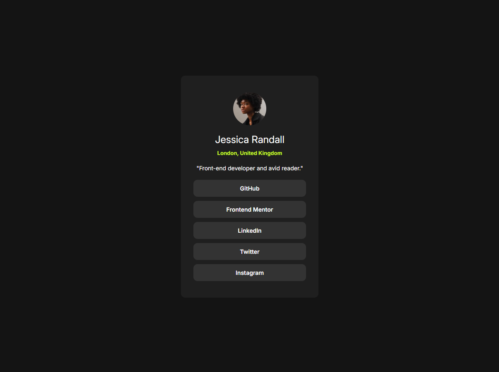
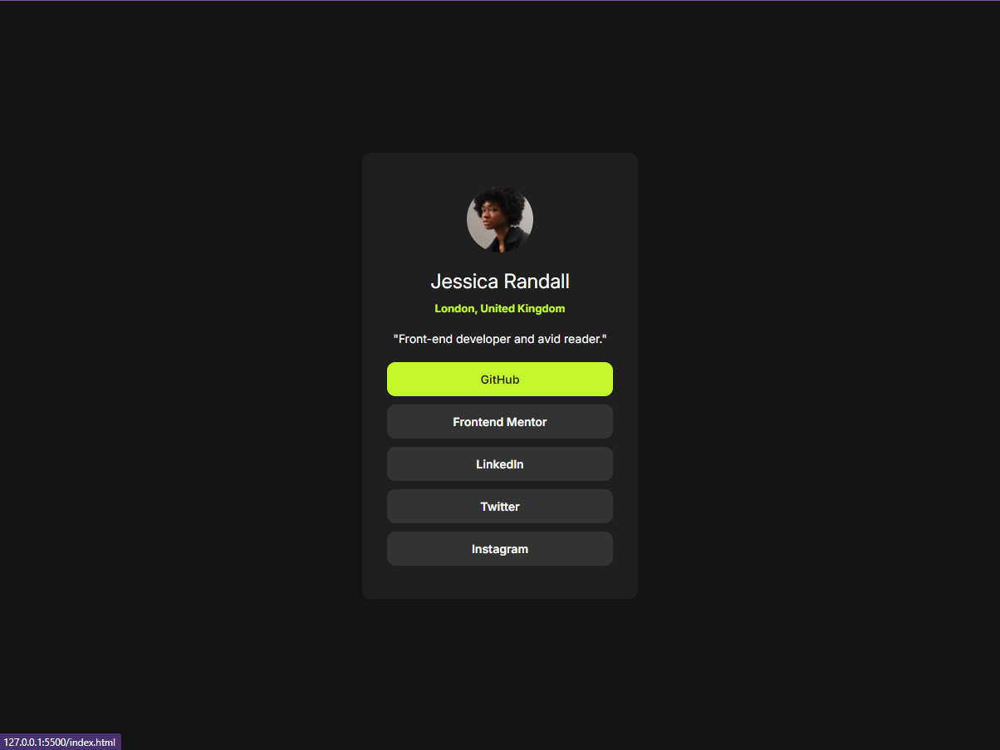
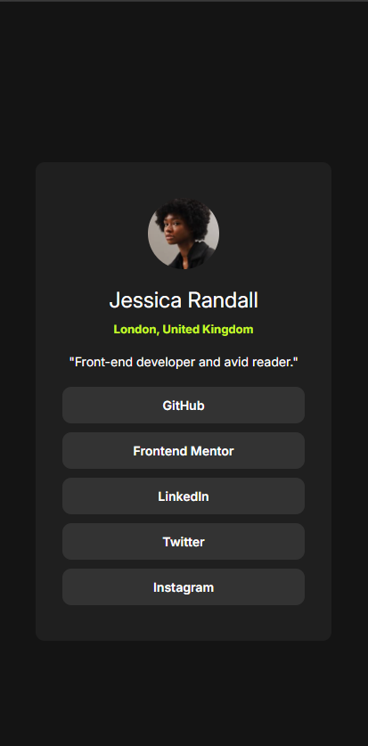

# Solução do "Frontend Mentor - Social links profile"

Esse foi a resolução do [desafio Social links profile do Frontend Mentor](https://www.frontendmentor.io/challenges/nft-preview-card-component-SbdUL_w0U).

## [Vizualize o projeto clicando aqui](https://itsdavss.github.io/social-links-profile/) ##

## Tabela de conteúdos

- [Visão geral](#visão-geral)
  - [Desafio](#desafio)
  - [Screenshots](#screenshots)
- [Meu processo](#meu-processo)
  - [Dificuldades e aprendizados](#dificuldades-e-aprendizados)
  - [Desenvolvido com](#desenvolvido-com)
- [Autor](#autor)

## Visão geral

### Desafio

#### Design do desktop

#### Design ativo

### Screenshots

#### Screenshot do desktop

#### Screenshot ativo

#### Screenshot do mobile

## Meu processo

### Dificuldades e aprendizados

O desenvolvimento foi bem tranquilo e sem nenhuma dificuldade.

### Desenvolvido com

- HTML5 
- CSS
- Flexbox

## Autor

- GitHub - [itsdavss](https://github.com/itsdavss)
- Meu portfólio - [Davi Oliveira](https://itsdavss.github.io/portfolio/)
- Frontend Mentor - [@itsdavss](https://www.frontendmentor.io/profile/itsdavss)
